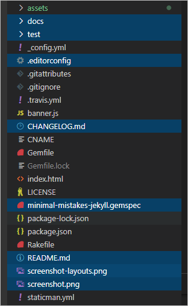

## 1. jekyll minimal mistakes 테마의 비밀
jekyll 블로그 테마중에 인기가 많은 minimal mistakes는 사실 비밀이 있다. 테마를 적용하려면 git 저장소의 내용을 fork 해야하는데 이때 자잘한 파일들도 같이 온다는 것이다.

사실 깃허브 블로그를 시작하고 알아버렸는데, 서버 호스팅이 무료이긴 하지만, 저장소의 크기가 1GB가 넘어 버리면 그 때 부터는 유료라는 것이 큰 단점이다.

일단 한 번 넘기 시작하면 매월 8~9천원 정도를 지불해야하는 것이다. 이미 그런데 나는 도메인을 구매했기 때문에 돌이킬 수도 없는 노릇. 그래서 최소한의 용량으로 살아가려고한다. 😅

## 2. minimal mistakes 최적화
그럼 본격적으로 필요없는 파일들과 폴더들을 하나씩 제거해 나가도록 하자.

사실 그렇게 큰 용량은 아니지만, `_config.yml` 등 실제 우리가 사용하는 파일명이 곂치는 것이 있어서 가끔 <kbd>ctrl+f</kbd> 단축키로 뭔갈 검색하고 수정했는데, 반영이 안되있으면 당혹스럽지 않겠는가.

### 2.1. 필요없는 파일 목록
fork로 인해 딸려오는 필요없는 파일들은 아래와 같다.

1. `.editorconfig`
2. `.gitattributes`
3. ~~`.github`~~
4. `/docs`
5. `/test`
6. `CHANGELOG.md`
7. `minimal-mistakes-jekyll.gemspec`
8. `README.md`
9. `screenshot-layouts.png`
10. `screenshot.png`

위 목록을 참고해서 저장소를 정리하면 되겠다. 보면 `.github`파일도 제거해도 된다고 되어있는데, 사실 이 부분은 git에 대한 여러분의 추가 설정이 들어가 있을 수도 있으므로 삭선처리했다.

파일명만 있으면 헷갈려하는 분들이 있어서 해당 파일을 vs code에서 선택해서 첨부하니 이를 참고하기바란다.

-------------------------
**Recommend:**  
- [깃허브(GitHub) 블로그 시작하기 Jekyll로 쉽게 만들기 가능]({{ site.url }}/blog/How-to-Create-a-GitHub-Blog/)
- [깃허브 블로그에 리디바탕 폰트 적용하기]({{ site.url }}/blog/Change-the-GitHub-Blog-Font-RIDIBatang/)
{: .notice--info}